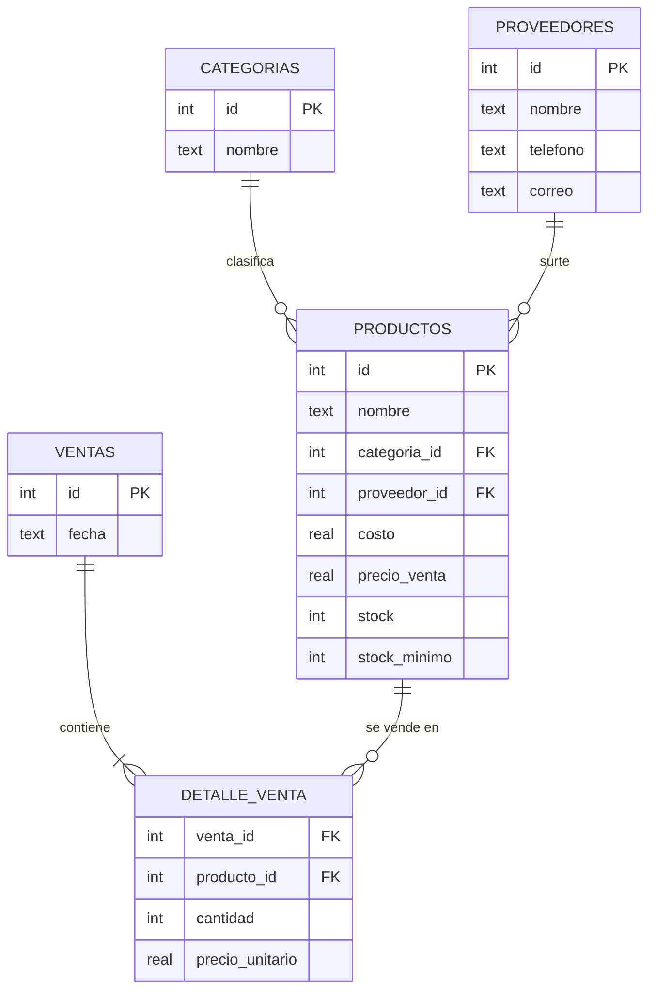

# 🏪 Base de datos de inventario y ventas (SQL)

Diseño e implementación de una **base de datos relacional** para una tienda pequeña: controla productos, proveedores, ventas y existencias. El **inventario se actualiza solo** al registrar una venta, y la base **impide vender más de lo que hay**.

> Proyecto de práctica personal. Todos los datos (productos, proveedores, teléfonos) son **ficticios**.

## ✨ Qué incluye

- **Modelo relacional** con 5 tablas, llaves foráneas y restricciones `CHECK` (precios positivos, stock no negativo).
- **Triggers**:
  - `trg_validar_stock`: rechaza una venta si no hay existencias suficientes.
  - `trg_descontar_stock`: descuenta el stock automáticamente.
- **Vistas**: productos por resurtir y ventas por producto.
- **8 consultas de negocio**: inventario, productos por resurtir, más vendidos, ingresos por mes, ganancia por categoría, valor del inventario, ticket promedio y productos sin ventas.
- Script de Python que crea la base y muestra los resultados en tablas.

## 🗺️ Modelo de datos



## 📁 Estructura

```
sql-inventario-tienda/
├── sql/
│   ├── 01_esquema.sql        # tablas, índices, triggers y vistas
│   ├── 02_datos_ejemplo.sql  # datos ficticios
│   └── 03_consultas.sql      # consultas de negocio
└── ejecutar.py               # crea inventario.db y muestra resultados
```

## 🛠️ Tecnologías

- SQL (dialecto SQLite 3)
- Python 3.10+ con el módulo `sqlite3` (incluido en Python, no requiere instalar nada)

## ▶️ Cómo ejecutarlo

**Opción 1: con Python**

```bash
git clone https://github.com/arumando/sql-inventario-tienda.git
cd sql-inventario-tienda
python ejecutar.py
```

Ejemplo de salida:

```
=== 2. Productos que hay que resurtir (stock en o por debajo del mínimo) ===
  nombre             | stock | stock_minimo | faltante | proveedor   | telefono
  -------------------+-------+--------------+----------+-------------+-------------
  Refresco 600 ml    | 12    | 24           | 12       | Proveedor B | 000-000-0002
  Leche entera 1 L   | 8     | 12           | 4        | Proveedor A | 000-000-0001
  ...
=== Prueba del trigger: vender 999 piezas de 'Arroz 1 kg' ===
  Venta rechazada correctamente: Stock insuficiente para realizar la venta
```

**Opción 2: con la terminal de SQLite o DB Browser for SQLite**

```bash
sqlite3 inventario.db < sql/01_esquema.sql
sqlite3 inventario.db < sql/02_datos_ejemplo.sql
sqlite3 -header -column inventario.db < sql/03_consultas.sql
```

## 📸 Capturas

[PENDIENTE: captura de la salida de `python ejecutar.py`]

[PENDIENTE: captura del diagrama o de las tablas en DB Browser for SQLite]

## 📚 Qué aprendí

<!-- Revisa esta lista y escríbela con tus propias palabras. -->
- Normalizar un modelo de datos y relacionar tablas con llaves primarias y foráneas.
- Proteger la integridad de los datos con `CHECK`, `UNIQUE` y `NOT NULL`.
- Automatizar reglas de negocio con **triggers** en lugar de hacerlo a mano.
- Escribir consultas con `JOIN`, `LEFT JOIN`, `GROUP BY`, subconsultas y funciones de fecha.
- Usar **vistas** para no repetir consultas complejas.

## 🚀 Posibles mejoras

- Registrar compras a proveedores para aumentar el stock.
- Migrar el esquema a MySQL o PostgreSQL.
- Crear una interfaz sencilla (web o de escritorio) para registrar ventas.

## 👤 Autor

**José Armando García Bandera** — [github.com/arumando](https://github.com/arumando)
